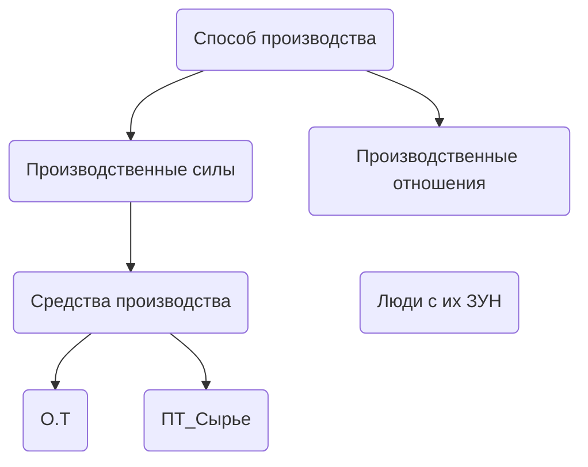

![[Лента времени.png|4960x2500]]
1. Ус. от.
2. Повышение производительности
3. Прибавочный продукт
4. Неравенство
5. Эксплуатация
6. Классы
7. Государства
8. Законы

Когда появилось понятие цивилизация? (В 18веке)
Сколько лет цивилизации?
(1. Биологической 2-3 миллиарда лет 2. Социально культурная 50тыс. лет)
Основа экономики первой цивилизации? (Аграрное)
Самая древняя культура? (Китай)
6 пунктов цивилизации
1. Правительство
2. Социальная структура
3. Религиозная система 
4. Высокоразвитая культура
5. Технологии
6. Письменность
### 4 Основных типа цивилизации 
1. Природные сообщества
2. Западно Американское
3. Восточный 
4. Современный
Какие цивилизации сейчас?
Китайское; Мусульманское; Западно Американское; Индийское
Какая по стадии цивилизация сейчас?
Нулевая; Первая это полное овладевайте ресурсами; Второй планетарная энергия всей солнечной системы; Третий не добывается
### Из чего состоят цивилизации
1. Населенные пункты
2. 
3. Коммуникации
4. Система управления
5. Разделение труда (Сложные)
6. Разделение людей на социальные и экономическое